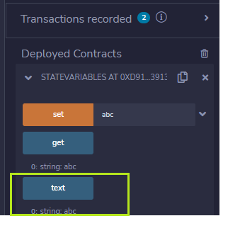

# learning_solidity_by_example

## State variables

Variable location

- Storate (permanent)

- Memory (while function call)

- Call data

Functions

- Create transaction (change the state of variable, smart contract, sending ether and change balance of contract ...)

- No transaction (no change state, only read and return value) - use `view` and `pure`

1. `view` does not write to blockchain
2. `pure` also does not write to blockchain and does not read state variables

Two ways to get `state variables`

- Write your own function

- Let Solidity write it



IPFS + Smart Contract

- Cheap storate

- Public data
## Payable

Payable for functions: Allows them to receive Ether together with a call.

- Payable address can receive Ether

```sh
  address payable public owner;
```

- Payable constructor can receive Ether

```sh
  constructor() payable {
      owner = payable(msg.sender);
  }
```

- Payable function to deposit Ether into contract

```sh
  // Function to deposit Ether into this contract.
  // Call this function along with some Ether.
  // The balance of this contract will be automatically updated.
  function deposit() public payable {
      emit Deposit(msg.sender, msg.value, address(this).balance);
  }
```

- Payable with address `to` for transfering Ether from this contract to address from input

```sh
function transferTo(address payable _to, uint _amount) public onlyOwner {
    _to.transfer(_amount); // Note: _amount get from balance of this contract's address, NOT from owner (***)
    emit Transfer(_to, _amount, address(this).balance);
  }
```
