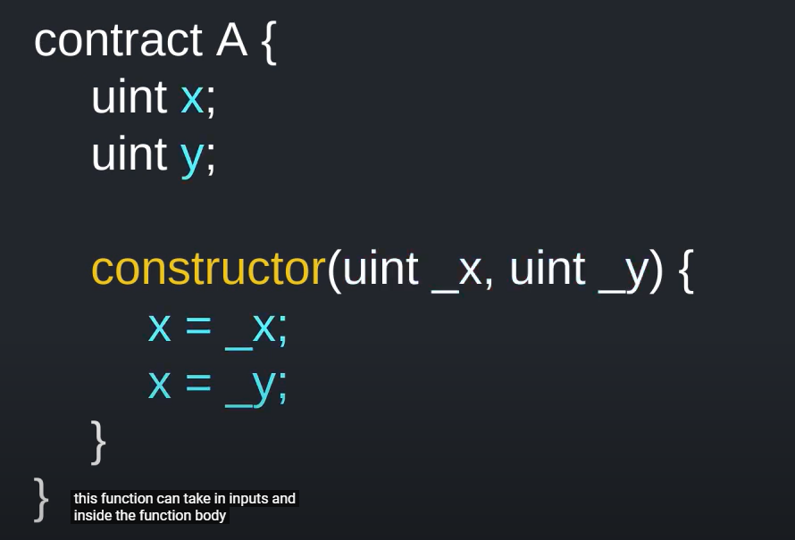
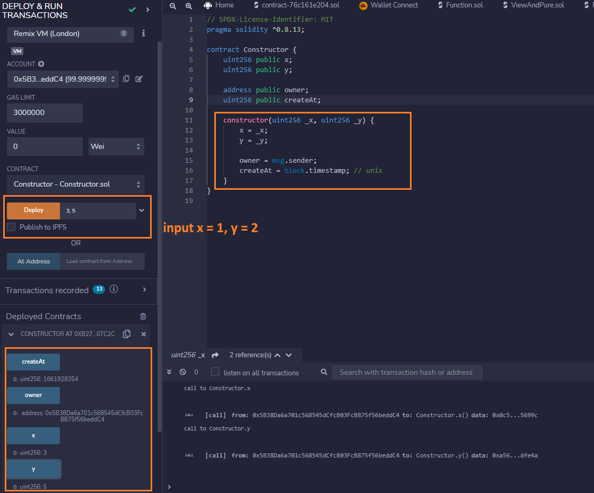
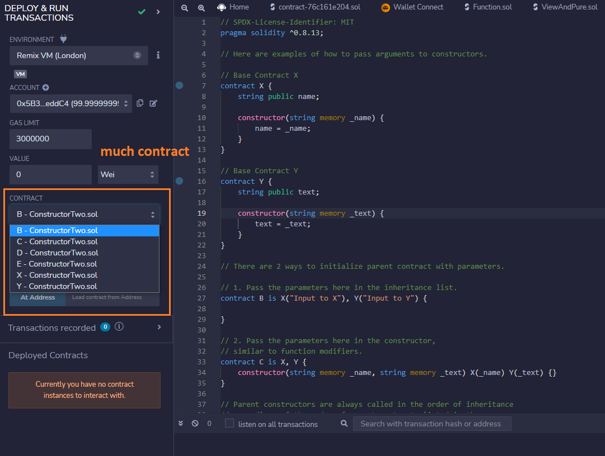
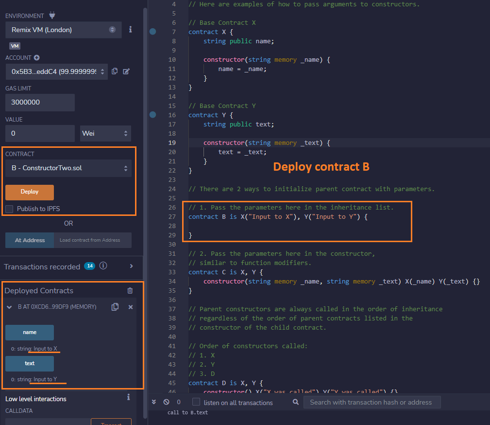
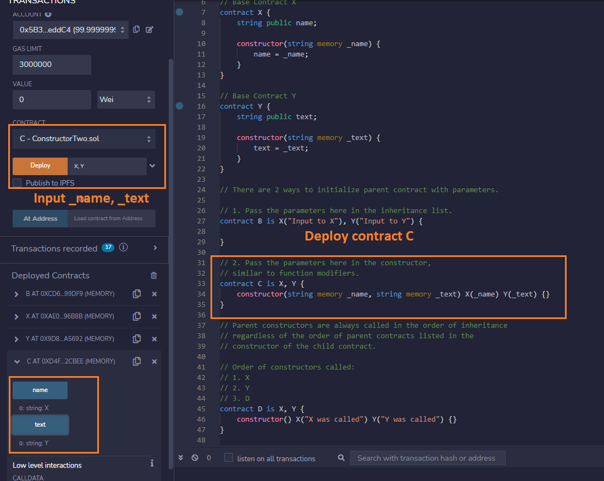

# Constructor

A `constructor` is an optional function that is executed upon contract creation.

Test

[Solidity Constructor](https://solidity-by-example.org/constructor/)

> Compile many contract

> Deploy contract B

> Deploy contract C

