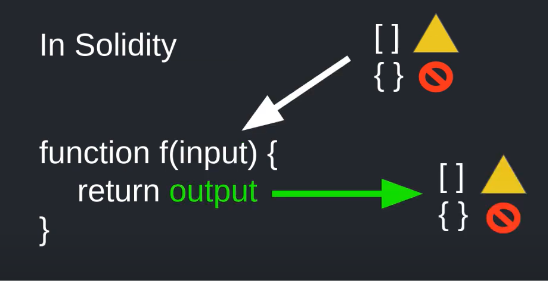
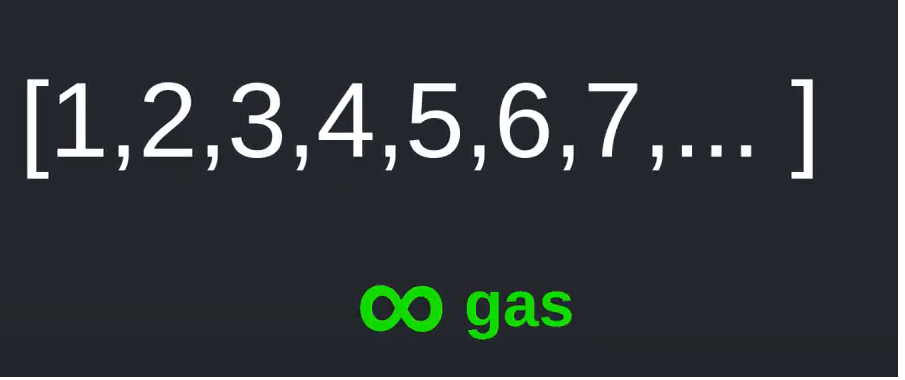
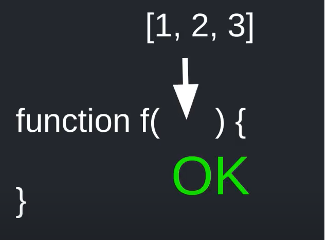
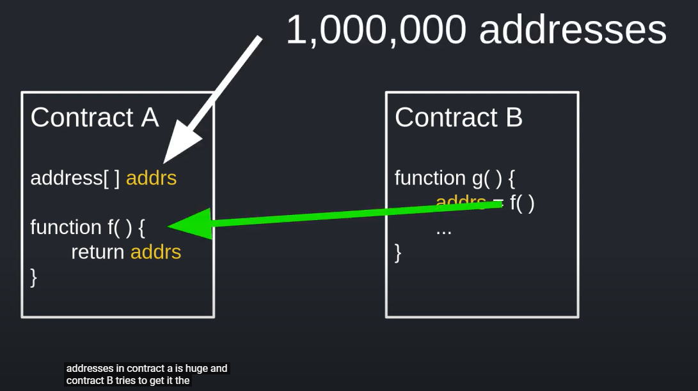
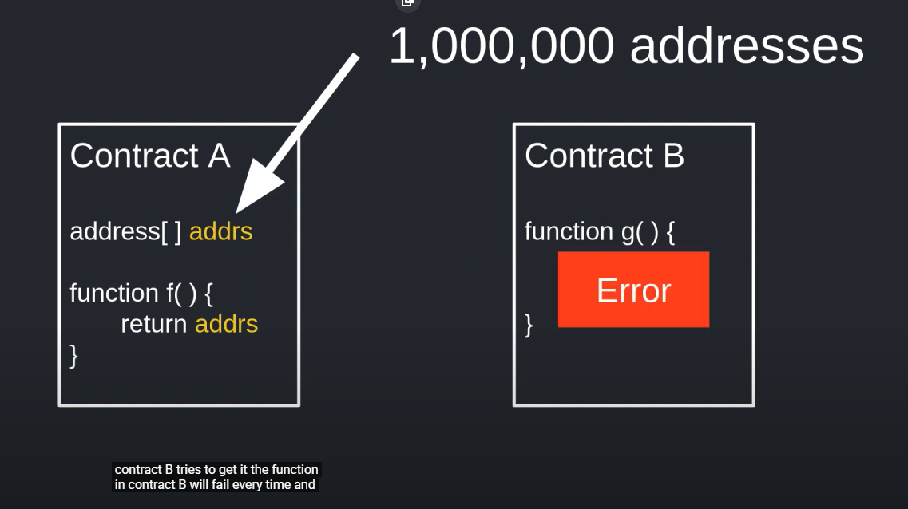
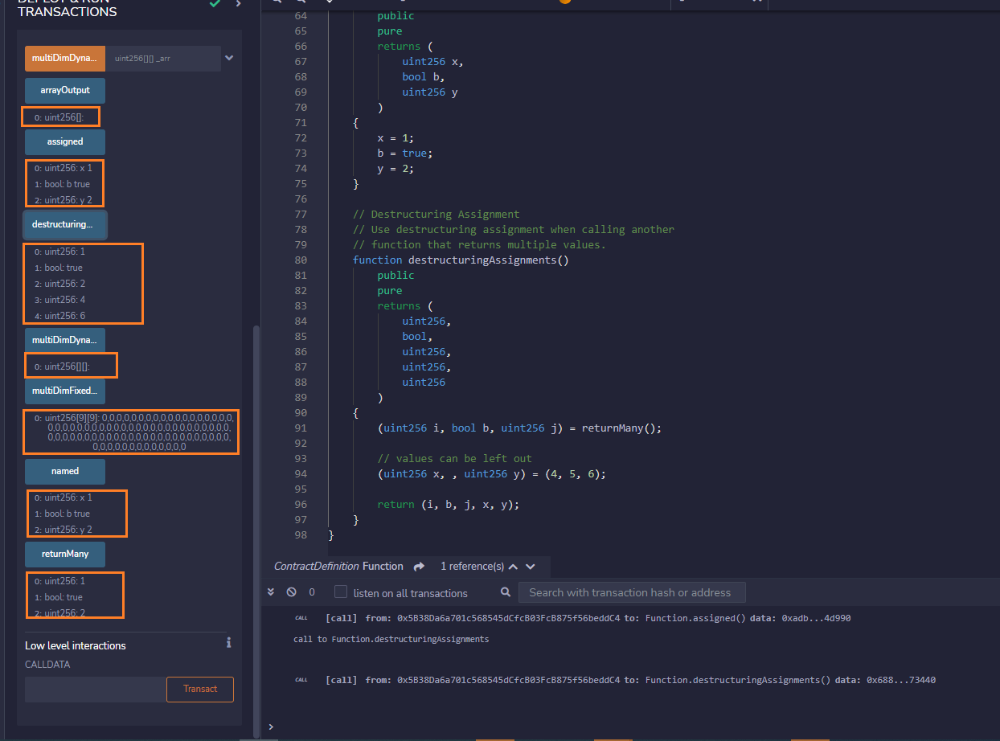

## Function

> Invalid input in Solidity

- {} map

- [][] multi-dimensional arrays (unfixed size)

> But in newest pragma, multi-dimensional dynamic size array (unfixed size) is valid

> Array is input not recomment. Why? `Gas`

> OK

> Error

Smart contracts should be

- Simple

- Reliable

- Predictable

Contract B tries to get addresses from Contract A

Limit gas is safe

Test Remix

