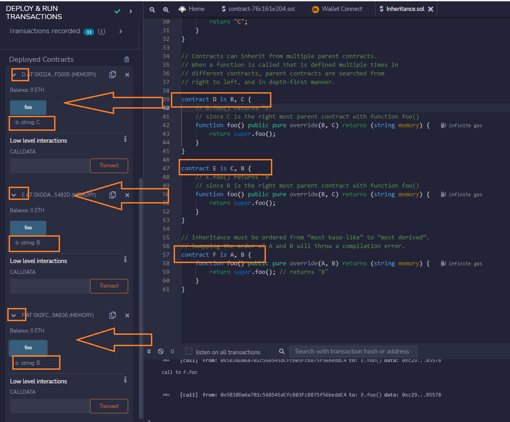
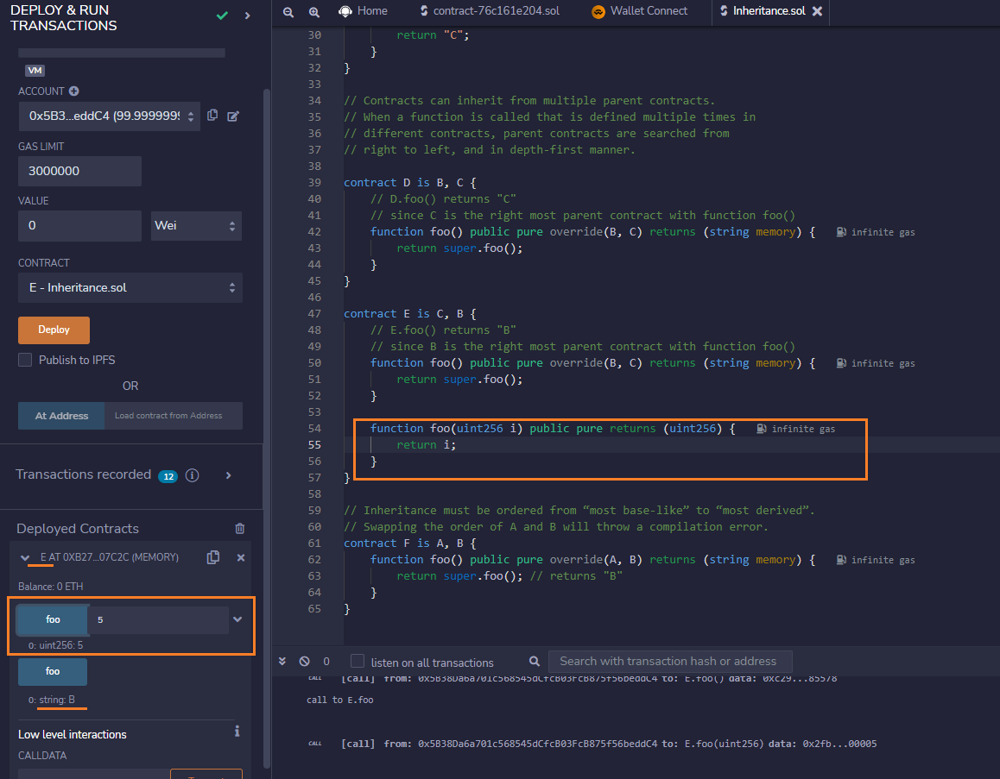
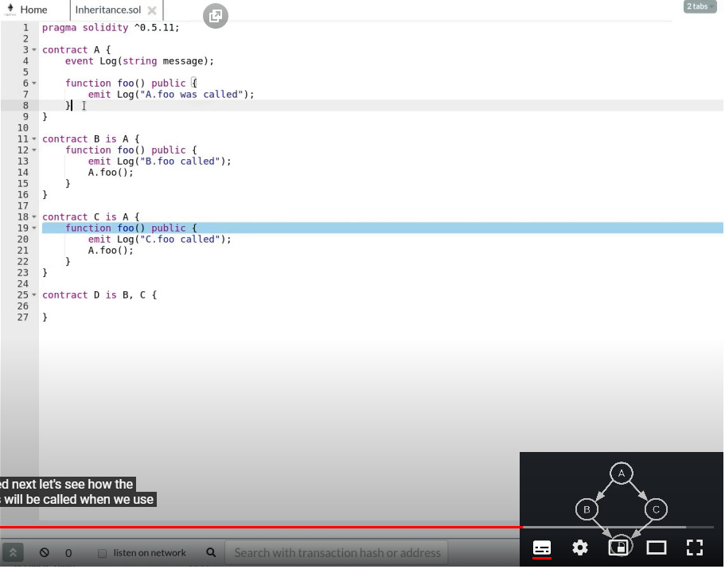
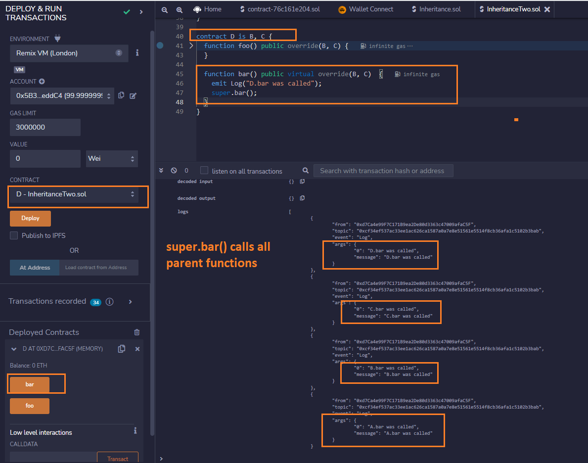
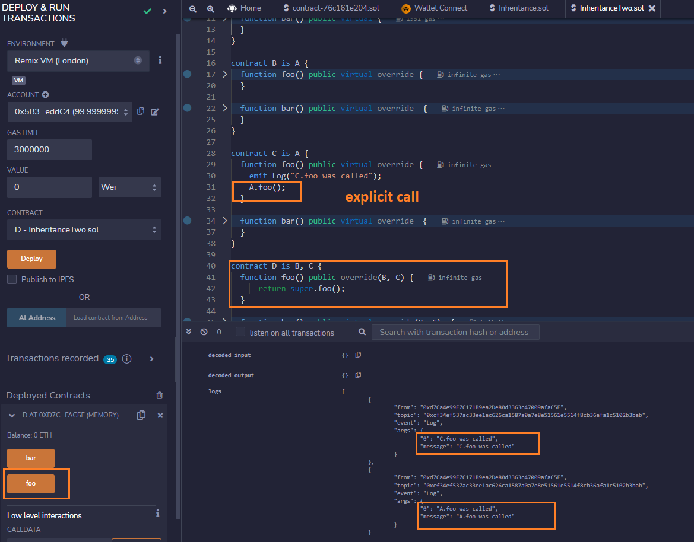

# Inheritance

Solidity supports multiple inheritance. Contracts can inherit other contract by using the `is` keyword.

Function that is going to be overridden by a child contract must be declared as `virtual`.

Function that is going to override a parent function must use the keyword `override`.

Order of inheritance is important.

You have to list the parent contracts in the order from “most base-like” to “most derived”.

Two ways calls parent function:

- Explicit

- Super

## Test

> Function is same name but has different parameters

## Other sample

> super.bar() calls all parent function

> explicit calls only right parent (C.foo) and most derived parent (A.foo)

