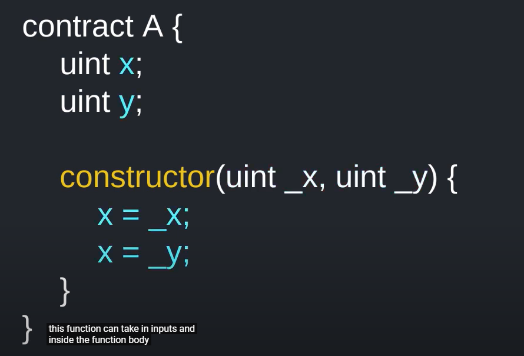
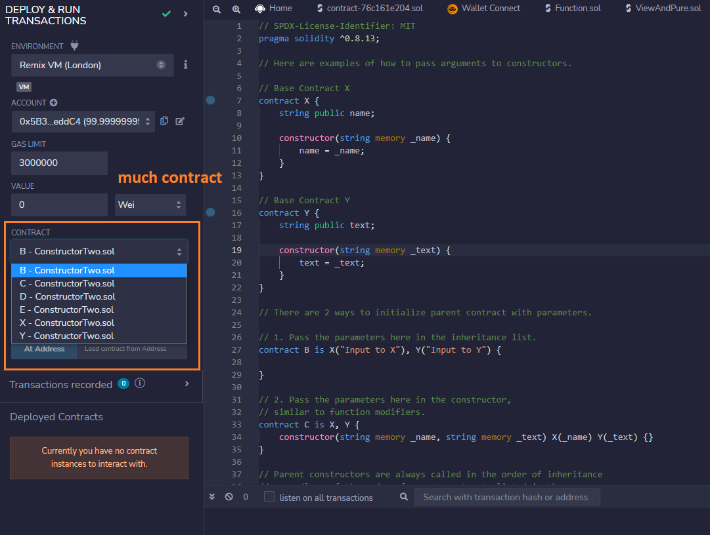
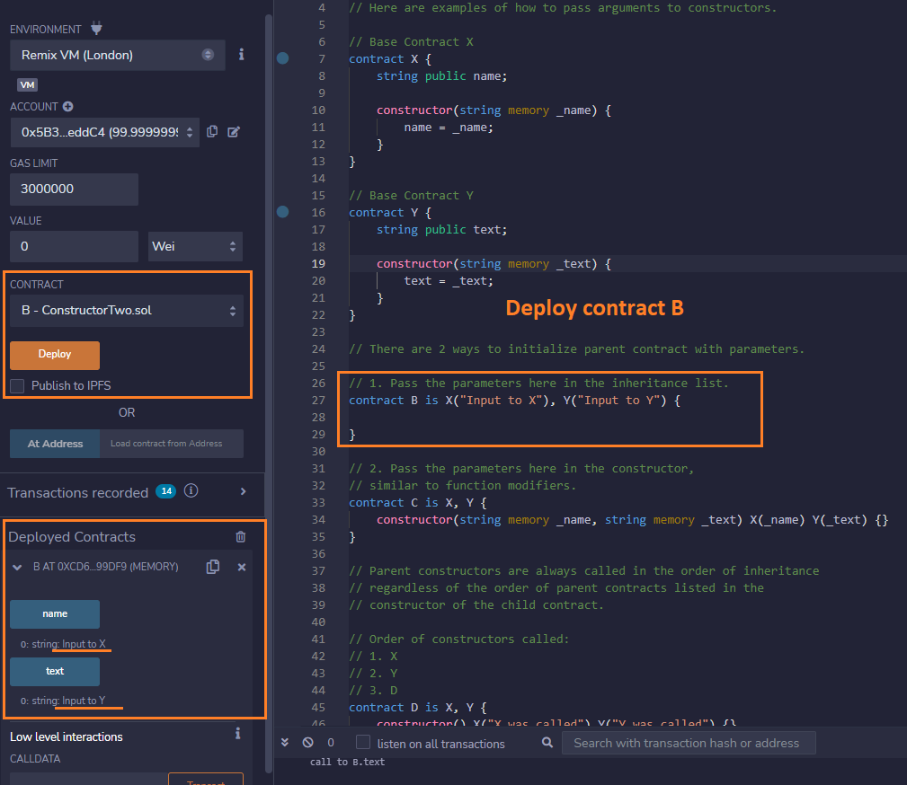

# Constructor

A `constructor` is an optional function that is executed upon contract creation.



Test


[Solidity Constructor](https://solidity-by-example.org/constructor/)

> There are 2 ways to initialize parent contract with parameters.

1. Pass the parameters here in the inheritance list.

```sh
contract B is X("Input to X"), Y("Input to Y") {
}
```

2. Pass the parameters here in the constructor, similar to function modifiers.

```sh
contract C is X, Y {
    constructor(string memory _name, string memory _text) X(_name) Y(_text) {}
}
```

> Compile many contract



> Deploy contract B



> Deploy contract C


