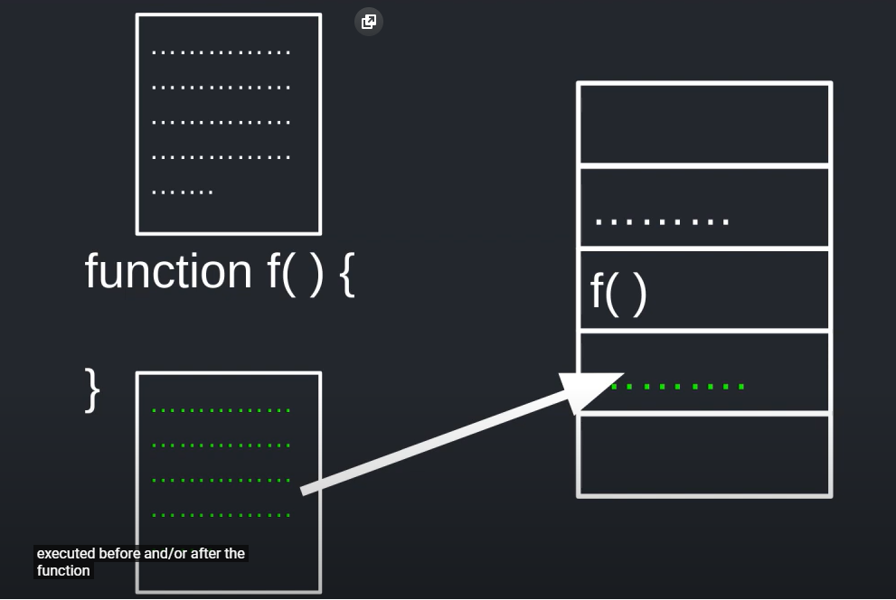
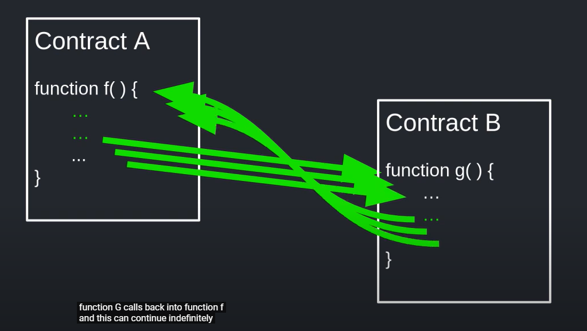
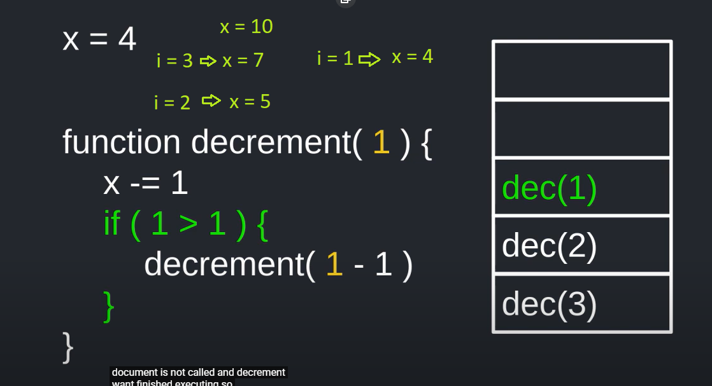
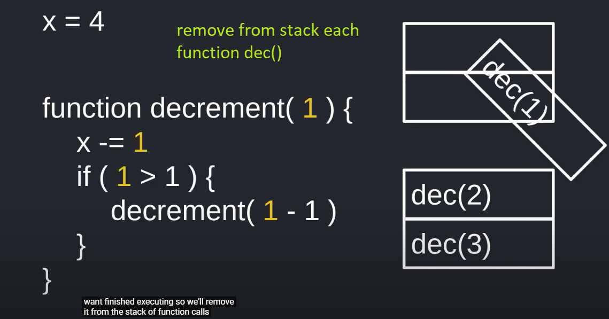
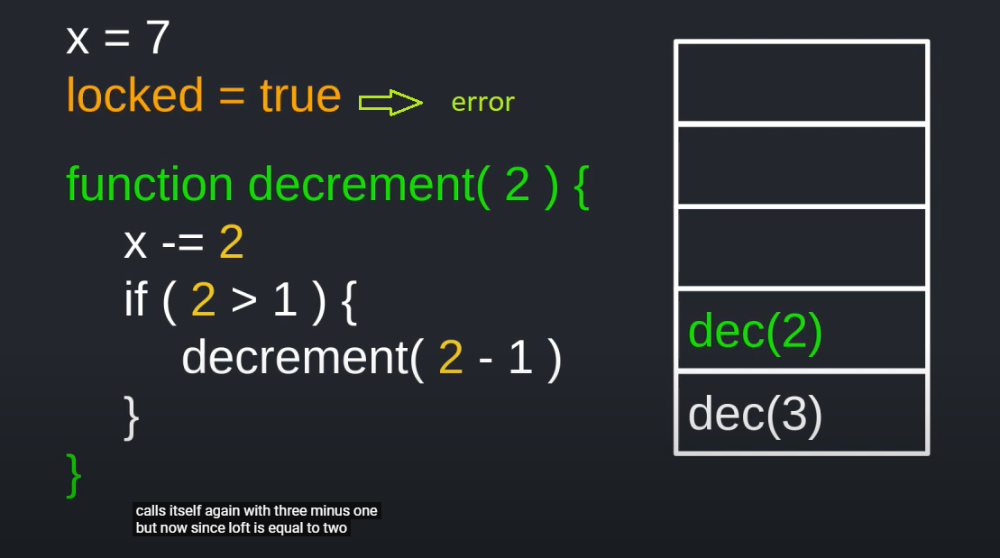
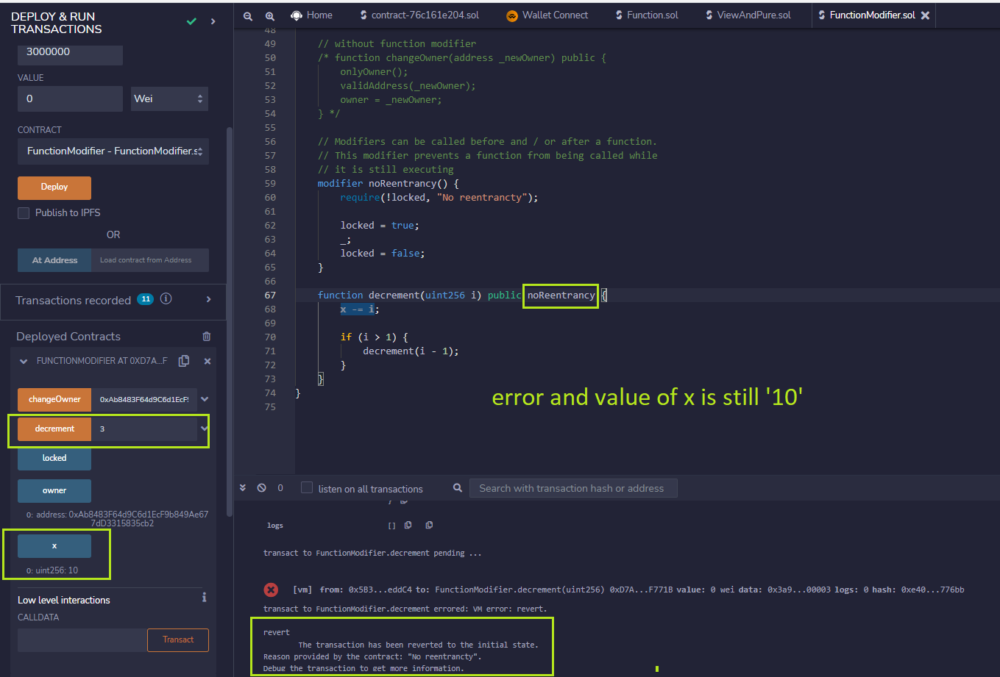
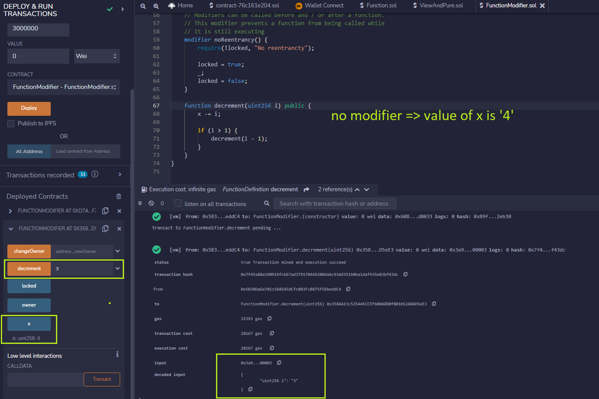

# Function modifier

Modifier are code that can be run before and/ or the function call.

Modifiers can be used to:

- Restrict access
- Validate inputs
- Guard against reentrancy hack

Underscore `_;` is a special character only used inside a function modifier and `it tells Solidity to execute the rest of the code`.

Infinitie contract B call function f() of contract A => lost of money

Examples

- Without modifier `noReentrancy`

- With modifier `noReentrancy`

Test

