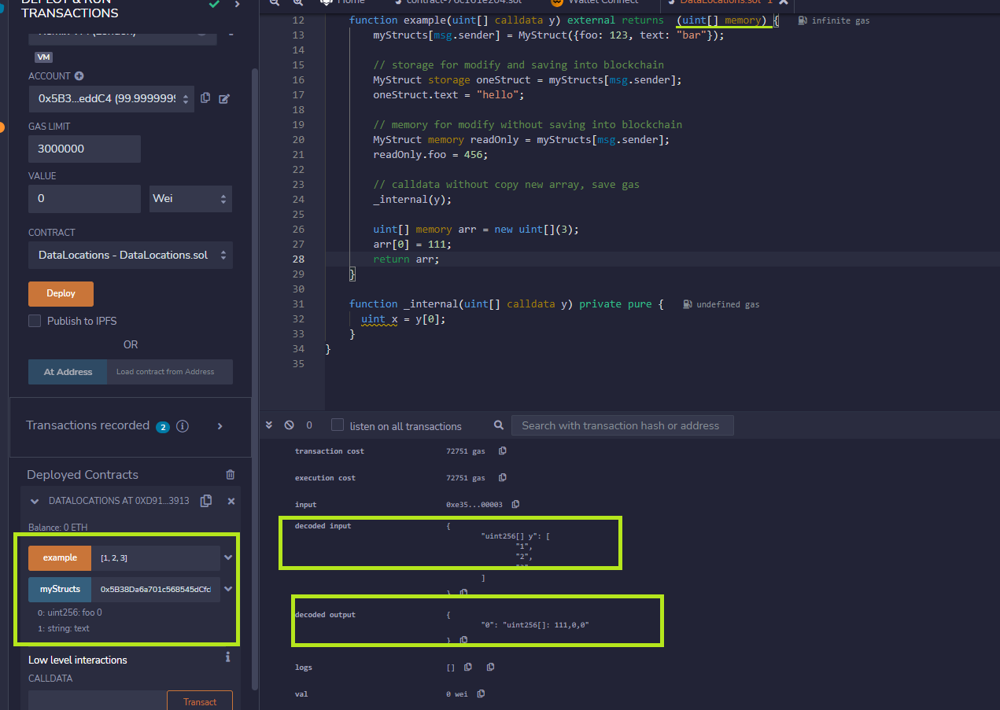
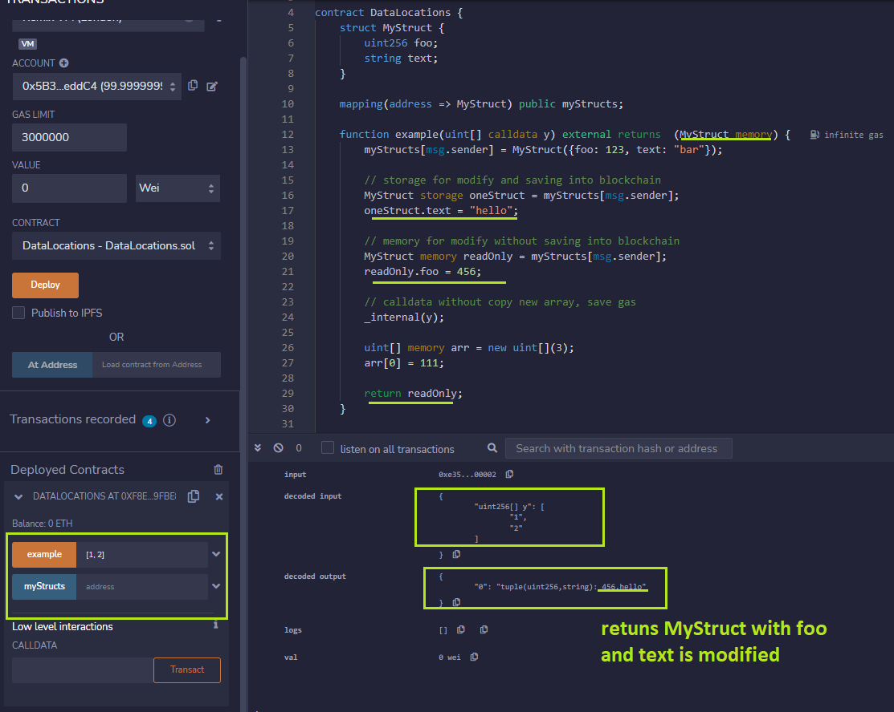
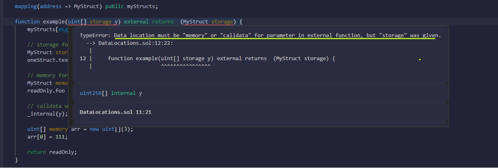

## [Data locations](https://solidity-by-example.org/data-locations/)

Variables are declared as either `storage`, `memory` or `calldata` to explicitly specify the location of the data.

- `storage` - variable is a state variable (store on blockchain)

- `memory` - variable is in memory and it exists while a function is being called, for readOnly or modify without saving it onto blockchain

- `calldata` - special data location that contains function arguments

> Size data

- In `storage` for dynamic data that you will update

- In `memory`, we can create fixed size array not dynamic size

> Function argument (input) and output - only use `memory` or `calldata`

- `memory` for function argument will copy new array and pass in function, `calldata` is without copy and save gas

- `calldata` for function argument (input) and cannot modified

> Test

- Only use `memory` or `calldata` for input and output function

