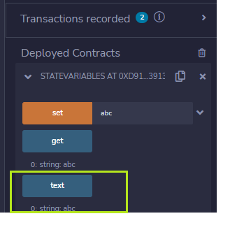

## State variables

Variable location

- Storate (permanent)

- Memory (while function call)

- Call data

Functions

- Create transaction (change the state of variable, smart contract, sending ether and change balance of contract ...)

- No transaction (no change state, only read and return value) - use `view` and `pure`

1. `view` does not write to blockchain
2. `pure` also does not write to blockchain and does not read state variables

Two ways to get `state variables`

- Write your own function

- Let Solidity write it

IPFS + Smart Contract

- Cheap storate

- Public data