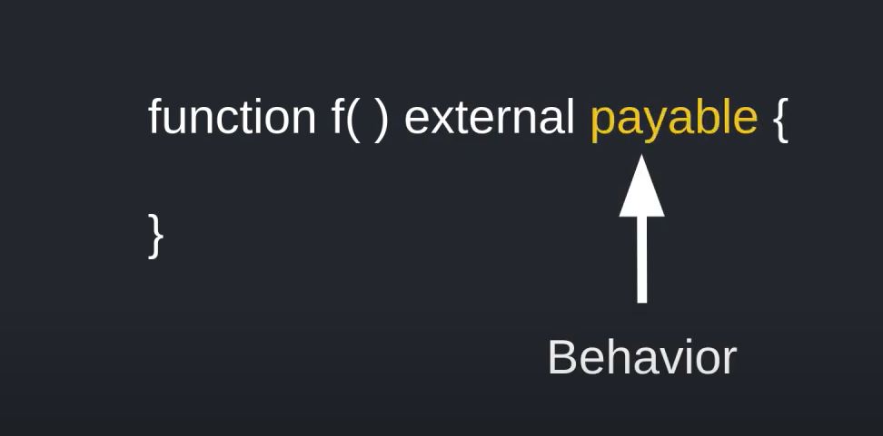
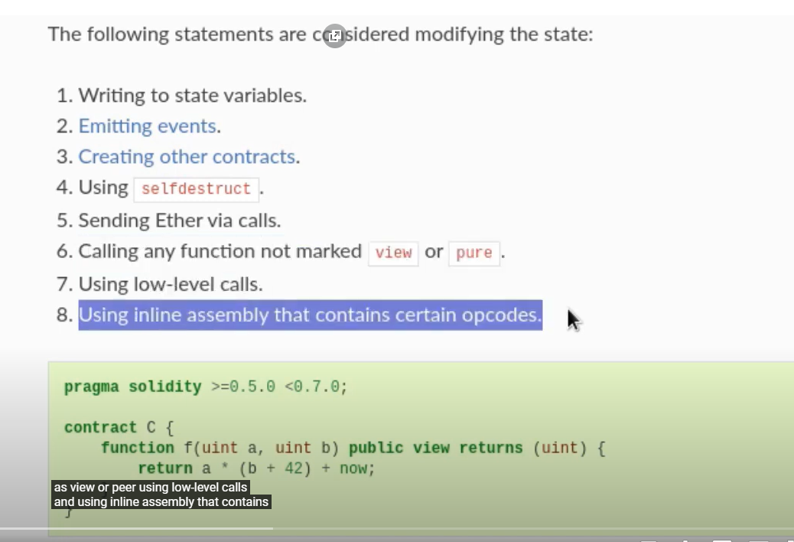
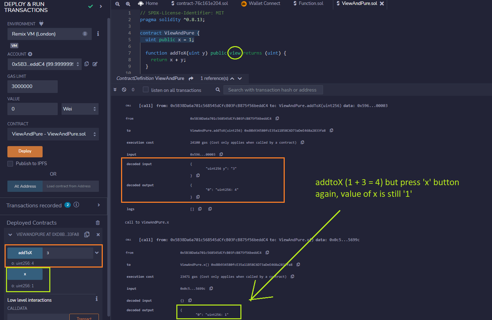
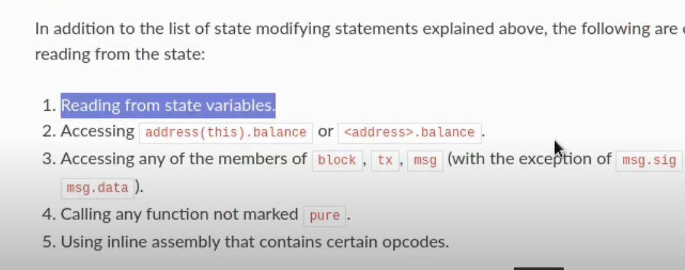
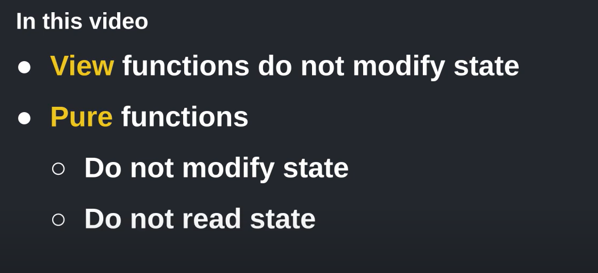

## View and Pure Function

Funtion has `visibility` and `behavior`



- Visibility

1. public
2. private
3. external
4. internal

- Behavior

1. view
2. pure
3. payable

`View` function decleares that no state will be changed.

`Pure` function declares that no state variable will be changed or read.

The following statement considered modifying the state



Test



The following statement considered reading the state



Sum up:



If miss `view` or `pure` functions, Remix will warning

- View

```sh
Warning: Function state mutability can be restricted to view
 --> ViewAndPure.sol:7:3:
  |
7 |   function addToX(uint y) public returns (uint) {
  |   ^ (Relevant source part starts here and spans across multiple lines).
```

- Pure

```sh
Warning: Function state mutability can be restricted to pure
  --> ViewAndPure.sol:26:3:
   |
26 |   function add(uint i, uint j) public returns (uint) {
   |   ^ (Relevant source part starts here and spans across multiple lines).

```
